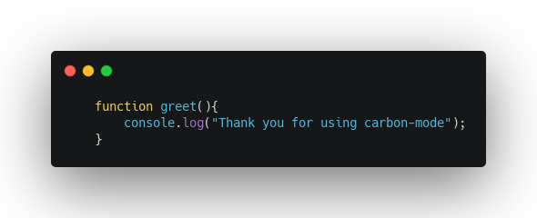

# Table of Contents

1.  [Carbon-mode](#org3fc1a9a)
2.  [Installation](#org53b087b)
3.  [How to use](#orgba171d7)
    1.  [List of arguments](#org4461865)
4.  [Notes](#org75e2422)

# Carbon-mode

This little emacs package is aimed to add some beauty to code snippets. It is using [Carbonara Project](https://github.com/petersolopov/carbonara) (which internally uses [Carbon](https://github.com/carbon-app/carbon)) to create an elegant image of your code.

# Installation

Due to my inexperience with emacs, I am only able to show how to install it with Doom Emacs (which is what I use):

1.  Add the following code to your `packages.el`
    
        (package! carbon-mode
         :recipe (:host github :repo "alvarezGarciaMarcos/carbon-mode.el") )
2.  Add the following code to your `config.el`
    
        (require 'carbon-mode)

# How to use

To use `carbon-mode` you have to create a script tag like the following:

    #+BEGIN_SRC carbon :language javascript :filename image1 :background "#FFFFFF"
         function greet(){
             console.log("Thank you for using carbon-mode");
         }
    #+END_SRC

Inside the script tag you have to place the code to be exported to an image.

Once you have entered the code you want to prettify, you just have to press `C-c C-c` (or `RET` if you are using `Doom Emacs`).
This will move your cursor above the script tag, fetch a new image from `Carbonara` and save it under the folder `./images` with the name that you have provided in the header.

This is the image that is generated by `carbon-mode` (inside the `./images/` folder you can see in this repo).

## List of arguments

This are all the possible arguments to use with the mode:

<table border="2" cellspacing="0" cellpadding="6" rules="groups" frame="hsides">

<colgroup>
<col  class="org-left" />

<col  class="org-left" />

<col  class="org-left" />
</colgroup>
<thead>
<tr>
<th scope="col" class="org-left">Arguments</th>
<th scope="col" class="org-left">Required</th>
<th scope="col" class="org-left">Meaning</th>
</tr>
</thead>

<tbody>
<tr>
<td class="org-left">:language</td>
<td class="org-left">yes</td>
<td class="org-left">The language you want the syntax-highlighting</td>
</tr>

<tr>
<td class="org-left">:filename</td>
<td class="org-left">yes</td>
<td class="org-left">The filename that your image will have</td>
</tr>

<tr>
<td class="org-left">:background</td>
<td class="org-left">yes</td>
<td class="org-left">The background that your image will have</td>
</tr>
</tbody>
</table>

# Notes

-   Right now you have to manually delete the code used to generate the image, this way you can re-generate the code how many times you want and delete the code once the result satisfies you.

